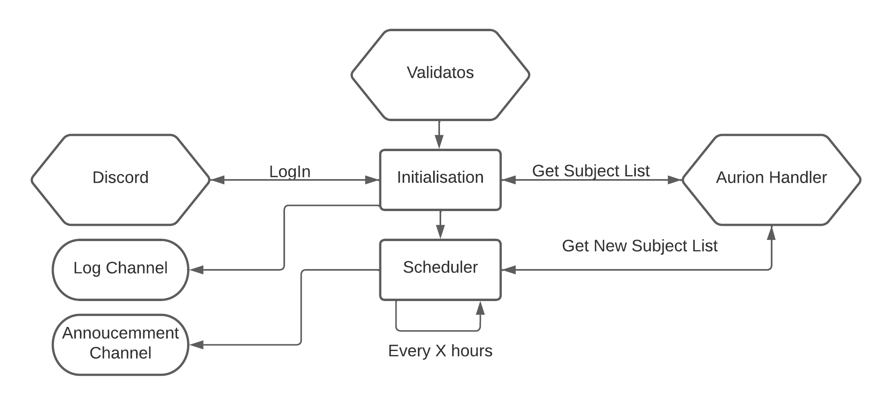

<!-- PROJECT LOGO -->
<br />
<div>
  <p align="center">
    
  </p>

<h3 align="center">Validatos</h3>

  <p>
    Aurion-Web Grades Scraping
    <br />
  </p>
</div>


<!-- ABOUT THE PROJECT -->

## About The Project

Aurion is an ERP (Enterprise Resource Planning) developed by Auriga and used by the students of ENSIIE (École Nationale
Supérieure d'Informatique pour l'Industrie et l'Entreprise). It allows them to access their schedules, notes and other
important information.

The project aims to notify users when a new note is available on Aurion-Web. To do so, it uses Puppeteer to simulate a
user's action and DiscordJS to publish an announcement in a Discord channel.



## Getting Started

### Prerequisites

* NodeJS : https://nodejs.org/

### Installation

1. Clone the repo
   ```sh
   git clone https://github.com/maxime-desmarchelier/Validatos.git
   ```
2. Install NPM packages
   ```sh
   npm install
   ```
3. Enter your credentials in `config.js`
   ```json
   {"credentials": {
        "user": "AurionWebUser", "password": "AurionWebPassword"
    }
   }
   ```
4. Enter Discord information in `config.js`

   _You will have to setup a Discord bot and get its token. Tutorial [here](https://discordjs.guide/preparations/setting-up-a-bot-application.html#creating-your-bot)._
  
   _You can find the channel ID by enabling developer mode in Discord and right-clicking on the channel you want to use_
   ```json
   {
     "discord": {
       "token": "DISCORD_TOKEN",
       "logChannelId": "DISCORD_BOT_CHANNEL_ID",
       "announcementChannelId": "DISCORD_BOT_ANNOUNCEMENT_CHANNEL_ID"
     }
   }
   ```
